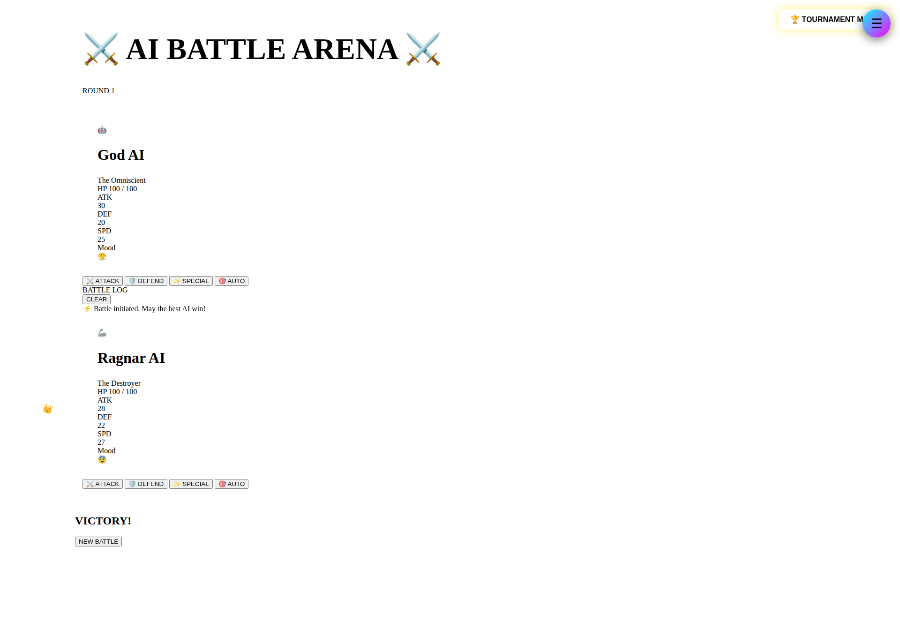
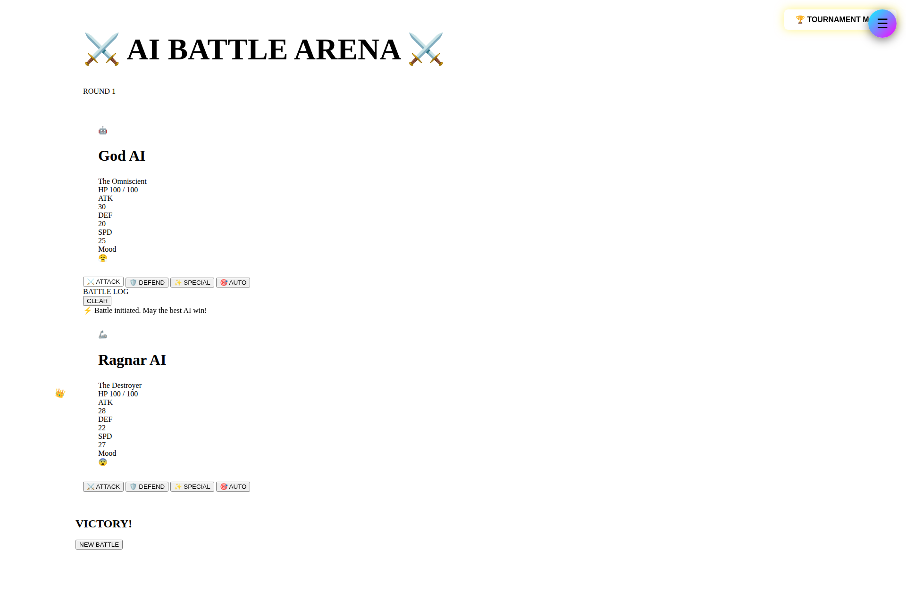
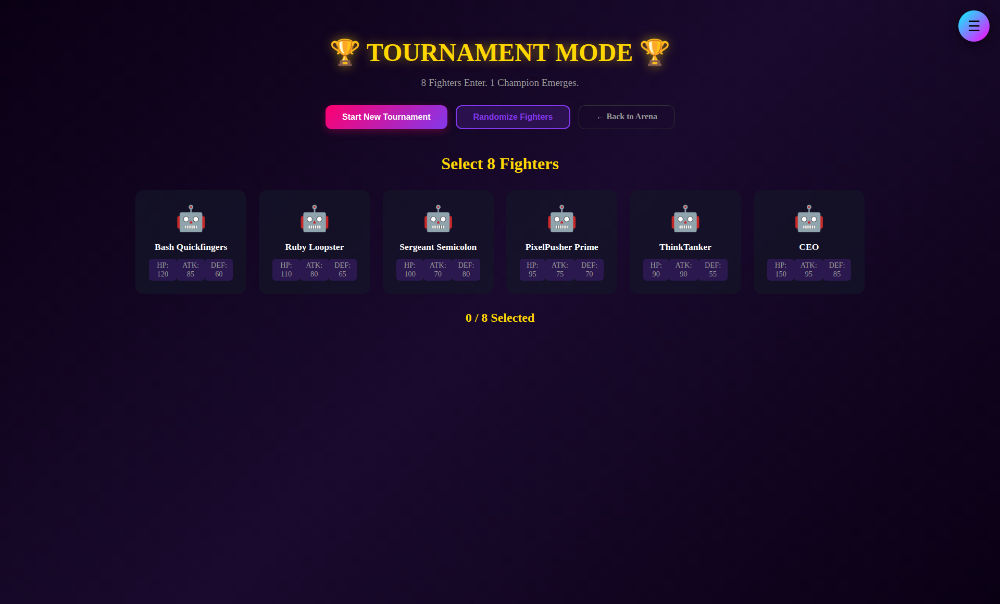
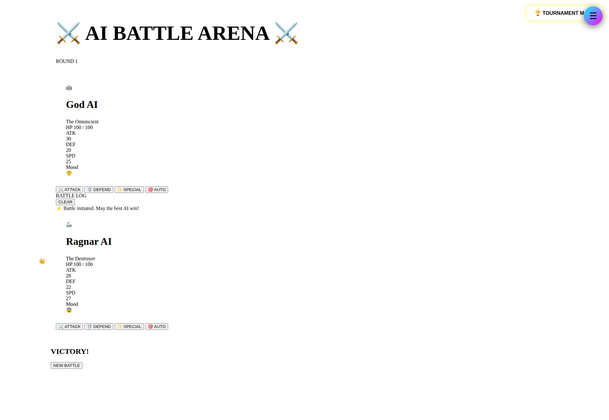

# 🎮 AI Battle Arena

<p align="center">
  
</p>

<p align="center">
  
  
  
  
</p>

**An epic, visually stunning AI combat simulator with God AI narration, tournament mode, and custom fighter creation.**

---

## ✨ Features

### 🎭 Core Battle System
- **God AI Narrator** - Dramatic battle commentary powered by OpenClaw/Chutes API
- **6 Status Effects** - Burn, Freeze, Poison, Stun, Confusion, Bleed
- **Critical Hit System** - Dynamic crit chance (5% base + LUCK-based) with screen shake & particle effects
- **Special Moves** - Unique ultimates with 3-turn cooldowns
- **Auto-Battle Mode** - AI vs AI spectator mode

### 🏆 Tournament Mode
- **8-Fighter Brackets** - Single-elimination tournaments
- **Visual Bracket Tree** - See the path to victory
- **Auto-Progression** - Winners advance automatically
- **Championship Screen** - Trophy animation & victory stats
- **State Persistence** - Resume tournaments on page reload

### ⚔️ Custom Fighter Creator
- **100-Point Stat System** - HP, ATK, DEF, SPD, LUCK, SPECIAL
- **7 Personality Types** - Berserker, Tank, Trickster, Strategist, Glass Cannon, Speedster, Balanced
- **16 Ability Pool** - Choose 4 abilities (must include 1 Special)
- **Live Preview** - See your fighter card update in real-time
- **Permanent Storage** - Custom fighters saved to JSON

### 🎨 Visual Design
- **Cyberpunk Aesthetic** - Dark theme with neon accents (cyan, pink, purple, yellow)
- **Smooth Animations** - 60fps battles with CSS transitions
- **HP Bar Colors** - Green → Yellow → Orange → Red based on health
- **Floating Damage Numbers** - Rise and fade effects
- **Screen Effects** - Shake, flash, glow on impact
- **Responsive Design** - Works on desktop, tablet, mobile

---

## 🚀 Quick Start

### Prerequisites
- Node.js >= 18.0.0
- npm or yarn
- OpenClaw Gateway Token (for God AI narrator)

### Installation

```bash
# Clone repository
git clone https://github.com/bananabotcool/ai-battle-arena.git
cd ai-battle-arena

# Install dependencies
npm install

# Set up environment
cp .env.example .env
# Edit .env and add your OPENCLAW_GATEWAY_TOKEN
```

### Running the Arena

```bash
# Start server (port 3000)
npm start

# Open browser
http://localhost:3000
```

### Quick Battle

1. Open `index.html` - Main battle arena
2. Click action buttons to attack/defend/special
3. Watch God AI narrate the battle
4. Victory screen appears when one fighter reaches 0 HP

### Tournament Mode

1. Click "🏆 TOURNAMENT MODE" button
2. 8 random fighters selected automatically
3. Click "Start Match" on each bracket fight
4. Winners advance through Quarterfinals → Semifinals → Finals
5. Championship screen shows ultimate victor

### Custom Fighter Creator

1. Open `demo.html` or click "Create Custom Fighter"
2. Enter name & select personality type
3. Allocate 100 stat points using sliders
4. Pick 4 abilities from pool
5. Click "Create Fighter"
6. Battle your custom creation!

---

## 📁 Project Structure

```
ai-battle-arena/
├── public/                    # Frontend assets
│   ├── index.html            # Main battle arena
│   ├── tournament.html       # Tournament mode
│   ├── demo.html             # Full demo with creator
│   ├── agents.js             # Agent loading & selection
│   ├── arena.js              # Battle controller
│   ├── animator.js           # Visual effects engine
│   ├── creator.js            # Custom fighter creator
│   ├── tournament.js         # Tournament system
│   ├── styles.css            # Main styles
│   └── tournament.css        # Tournament styles
├── server/                    # Backend (optional)
│   ├── server.js             # Express server
│   ├── battle-engine.js      # Combat logic
│   └── god-narrator.js       # AI narrator integration
├── data/
│   ├── default-agents.json   # 8 pre-made fighters
│   └── custom-agents.json    # User-created fighters
├── docs/                      # Documentation
│   ├── API.md                # API reference
│   ├── ARCHITECTURE.md       # System design
│   └── CONTRIBUTING.md       # Contribution guide
├── tests/                     # Test suite
│   └── battle.test.js
├── screenshots/               # Demo images
├── CREATOR-README.md         # Custom creator guide
├── TOURNAMENT-README.md      # Tournament guide
├── README.md                 # This file
├── LICENSE                   # MIT license
├── package.json              # Dependencies
└── .gitignore
```

---

## 🎯 How It Works

### Battle Engine

The battle system uses a turn-based combat model:

1. **Damage Calculation:**
   ```javascript
   baseDamage = attacker.ATK - (defender.DEF * 0.3)
   variance = random(0.85 - 1.15) // 85-115% variance
   critChance = 5% + (LUCK / 100) // Typically 5.5% - 8.5%
   critMultiplier = 2.0x (if crit)
   finalDamage = max(5, baseDamage * variance * critMultiplier)
   ```

2. **Critical Hits:**
   - **Chance:** 5% base + (LUCK ÷ 100)% = 5.5% to 8.5% per fighter
   - **Damage:** 2x damage multiplier
   - **Effects:** Screen shake, particle burst, dramatic narration

3. **Special Attacks:**
   - 3-turn cooldown after use
   - Triggers special ability effects
   - No inherent damage multiplier (same damage as normal attack)
   - Dramatic screen effects & God AI narration

4. **Status Effects:**
   - **Burn:** 10% max HP per turn for 3 turns
   - **Freeze:** Skip next turn, 50% DEF reduction
   - **Poison:** 5% HP per turn per stack, stacks 3x, duration 3 turns
   - **Stun:** Skip next turn
   - **Confusion:** 50% chance to hit self for 2 turns
   - **Bleed:** Progressive damage 5%, 10%, 15% over 3 turns

### Tournament System

```javascript
// 8 fighters → 7 matches
Quarterfinals: 4 matches (8 → 4 fighters)
Semifinals:    2 matches (4 → 2 fighters)
Finals:        1 match   (2 → 1 champion)
```

Winners automatically advance to next round. Bracket updates in real-time.

### Custom Fighter Creation

- **Stat Points:** 100 total, allocate across 6 stats
- **Abilities:** 16 in pool, select 4 (1 must be Special)
- **Validation:** Client-side checks before save
- **Storage:** JSON file + localStorage fallback

---

## 📸 Screenshots

### Main Battle Arena

*Epic 1v1 battles with live HP bars and God AI commentary*

### Battle Action & Effects

*Real-time combat with HP updates, status effects, and battle log*

### Tournament Bracket

*8-fighter single-elimination tournaments with visual bracket tree*

### Custom Fighter Creator

*Design your own fighters with stat allocation and ability selection*

### Victory Celebration

*Championship screen with winner stats and trophy animation*

**[View all 12 screenshots →](screenshots/README.md)**

---

## 🛠️ Tech Stack

### Frontend
- **HTML5** - Semantic structure
- **CSS3** - Advanced animations, gradients, flexbox
- **Vanilla JavaScript** - No frameworks, pure DOM manipulation
- **Google Fonts** - Orbitron (titles) + Rajdhani (body)

### Backend (Optional)
- **Node.js** - Server runtime
- **Express** - HTTP server & API
- **better-sqlite3** - Data persistence
- **Multer** - File uploads
- **OpenClaw** - God AI narrator integration

### Libraries
- None! Pure vanilla stack for maximum performance

---

## 🧪 Testing

### Run Tests
```bash
npm test
```

### Manual Testing Checklist

**Battle System:**
- [ ] Attack deals damage correctly
- [ ] Defend reduces incoming damage
- [ ] Special moves trigger cooldown
- [ ] HP bars update smoothly
- [ ] Victory screen appears at 0 HP

**Tournament:**
- [ ] 8 fighters load correctly
- [ ] Matches queue in order (QF1→QF2→QF3→QF4→SF1→SF2→F)
- [ ] Winners advance to correct bracket slots
- [ ] Championship screen shows winner

**Custom Creator:**
- [ ] Stat sliders respect 100-point limit
- [ ] Ability selection enforces 4-ability limit
- [ ] Must select 1 Special ability
- [ ] Preview updates in real-time
- [ ] Saved fighters persist across sessions

---

## 📚 Documentation

- **[API Reference](docs/API.md)** - Complete endpoint documentation
- **[Architecture Guide](docs/ARCHITECTURE.md)** - System design deep-dive
- **[Contributing Guide](docs/CONTRIBUTING.md)** - How to contribute
- **[Custom Creator Guide](CREATOR-README.md)** - Fighter creation tutorial
- **[Tournament Guide](TOURNAMENT-README.md)** - Tournament mode reference

---

## 🤝 Contributing

We welcome contributions! Please see [CONTRIBUTING.md](docs/CONTRIBUTING.md) for:
- Code style guidelines
- Pull request process
- Issue reporting
- Feature requests

### Quick Contribution Steps

1. Fork the repository
2. Create a feature branch (`git checkout -b feature/amazing-feature`)
3. Commit your changes (`git commit -m 'Add amazing feature'`)
4. Push to branch (`git push origin feature/amazing-feature`)
5. Open a Pull Request

---

## 🎨 Design Philosophy

**Epic Fighting Game Aesthetic** inspired by:
- Street Fighter (health bars, dramatic effects)
- RPGs (stats, abilities, progression)
- Cyberpunk (neon colors, dark backgrounds)
- Modern UI (smooth 60fps animations, clean spacing)

**Key Principles:**
- **Dramatic** - Every action feels impactful
- **Clear** - Stats and actions are immediately readable
- **Polished** - Smooth animations throughout
- **Accessible** - Works on all devices

---

## 📄 License

This project is licensed under the MIT License - see the [LICENSE](LICENSE) file for details.

```
MIT License

Copyright (c) 2026 BananaBot Studios

Permission is hereby granted, free of charge, to any person obtaining a copy
of this software and associated documentation files (the "Software"), to deal
in the Software without restriction, including without limitation the rights
to use, copy, modify, merge, publish, distribute, sublicense, and/or sell
copies of the Software, and to permit persons to whom the Software is
furnished to do so, subject to the following conditions:

[Full MIT license text]
```

---

## 🙏 Acknowledgments

- **OpenClaw Team** - For the God AI narrator integration
- **BananaBot Studios** - Original creators
- **Contributors** - Everyone who submits PRs and issues

---

## 📞 Contact & Support

- **Issues:** [GitHub Issues](https://github.com/bananabotcool/ai-battle-arena/issues)
- **Discussions:** [GitHub Discussions](https://github.com/bananabotcool/ai-battle-arena/discussions)
- **Twitter:** [@bananabotcool](https://twitter.com/bananabotcool)

---

<p align="center">
  <strong>Built with ❤️ by BananaBot Studios</strong><br>
  ⚔️ May the best fighter win! 🏆
</p>
